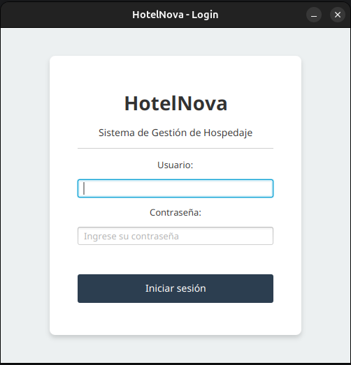
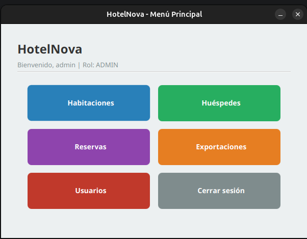
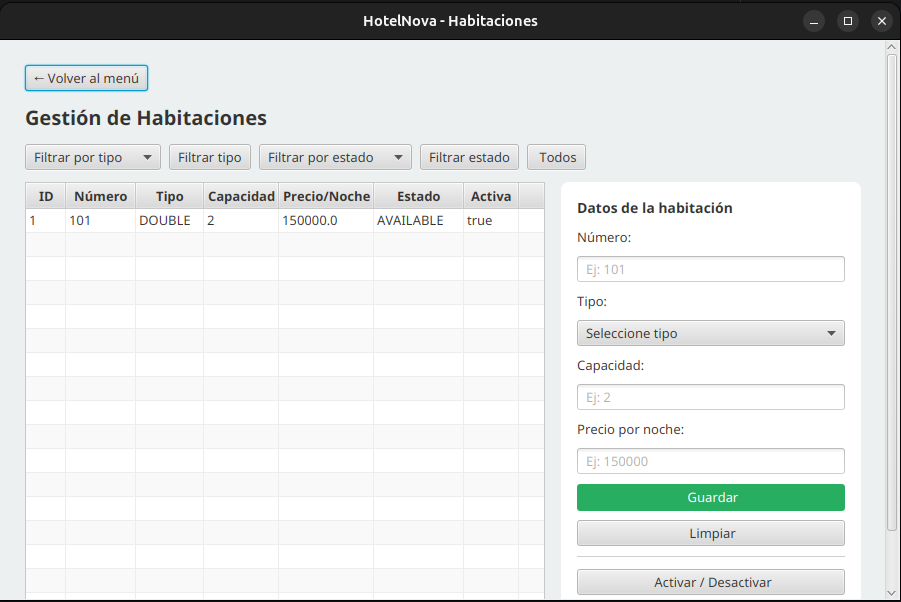
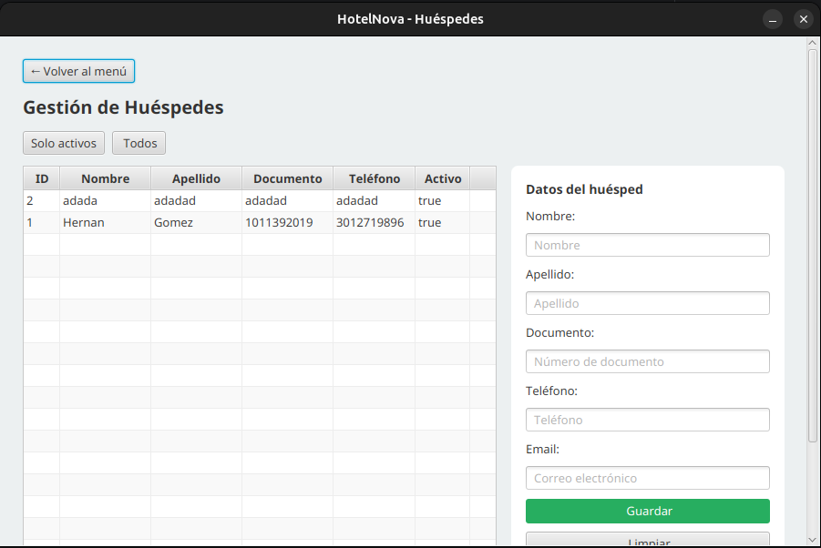
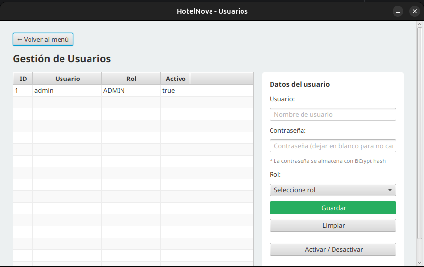
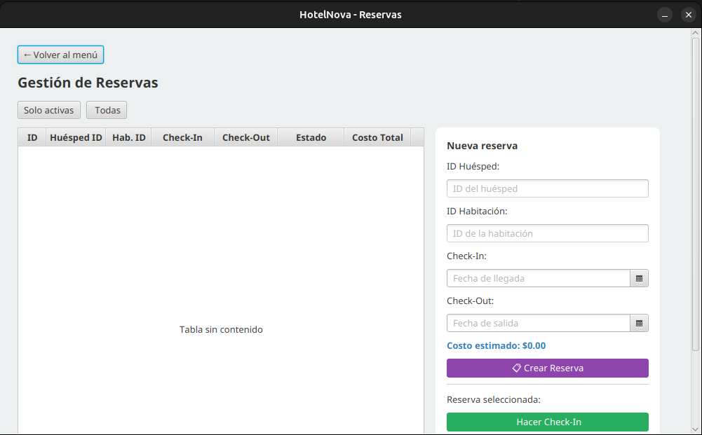
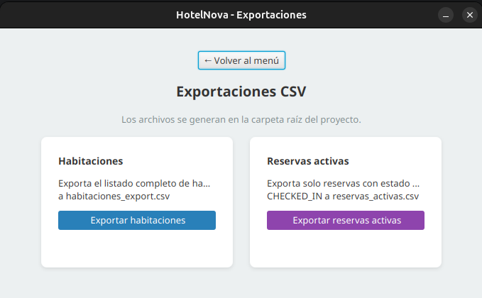

# HotelNova – Hotel Management System

> Performance Test – Module 5.1 Java | Riwi

---

## Developer Information

| Field | Detail |
|---|---|
| **Name** | Samuel Cardona |
| **Clan** | Hamilton |
| **Email** | riwimusa@gmail.com |

---

## General Description

HotelNova is a desktop application built with **Java SE 21** that centralizes the management of a hotel chain. It handles rooms, guests, users, and reservations through a clean layered architecture. The system enforces business rules such as room availability, guest active status, date range validation, and overlapping reservation detection. Critical operations (check-in and check-out) are handled with **JDBC transactions** to guarantee data consistency.

The graphical interface is built with **JavaFX**, persistence uses **PostgreSQL** hosted on Supabase, passwords are securely stored using **BCrypt** hashing, and the entire codebase follows a **package-by-feature** architecture for high modularity.

---

## Key Features

- **Room Management**: register, edit, activate/deactivate, filter by type and status.
- **Guest Management**: register, edit, activate/deactivate, filter active guests.
- **User Management**: register users with role-based access (ADMIN / RECEPTIONIST), passwords hashed with BCrypt.
- **Authentication**: secure login with role-based menu access.
- **Reservations**: create reservations with full validation, transactional check-in and check-out.
- **Cost Calculation**: automatic stay cost calculation including IVA (`nights × pricePerNight × (1 + IVA)`).
- **CSV Exports**: export full room list and active reservations.
- **Logging**: activity and errors logged to `app.log`, plus simulated HTTP traces in console.
- **Custom Exceptions**: business rule violations throw specific exceptions.
- **Unit Tests**: 11 unit tests covering all required business validations.

---

## Tech Stack

| Technology | Version | Purpose |
|---|---|---|
| Java SE | 21 | Core language |
| JavaFX | 21.0.2 | Graphical user interface |
| PostgreSQL | 42.7.3 (driver) | Persistence layer |
| Supabase | – | Cloud database hosting |
| BCrypt (jBCrypt) | 0.4 | Password hashing |
| JUnit 5 | 5.10.2 | Unit testing |
| Maven | 3.x | Build and dependency management |

---

## Prerequisites

Before running the project, make sure you have:

- **Java JDK 21** or higher installed.
- **Apache Maven 3.x** installed.
- **PostgreSQL** database (local or hosted on Supabase).
- An IDE like **IntelliJ IDEA** or **NetBeans** (recommended).
- **Git** for cloning the repository.

---

## Project Structure

The project follows a **package-by-feature** architecture, where each feature contains its own model, DAO, service, and controller:

```
HotelNova/
├── src/
│   ├── main/
│   │   ├── java/com/hotelnova/
│   │   │   ├── Main.java
│   │   │   ├── config/        # AppConfig, DatabaseConnection
│   │   │   ├── exception/     # 6 custom exceptions
│   │   │   ├── user/          # User feature (model, dao, service, controller, role)
│   │   │   ├── room/          # Room feature (model, dao, service, controller, status, type)
│   │   │   ├── guest/         # Guest feature
│   │   │   ├── reservation/   # Reservation feature with transactions
│   │   │   ├── ui/            # JavaFX views (Login, MainMenu, Rooms, Guests, Users, Reservations, Exports)
│   │   │   └── util/          # AppLogger, HttpLogger, CsvExporter, PasswordHasher
│   │   └── resources/
│   │       └── config.properties
│   └── test/
│       └── java/com/hotelnova/
│           ├── RoomServiceTest.java
│           └── ReservationServiceTest.java
├── docs/
│   └── screenshots/
├── pom.xml
├── schema.sql
└── README.md
```

---

## Setup and Execution Steps

### 1. Clone the repository

```bash
git clone https://github.com/musarnt/HotelNova.git
cd HotelNova
```

### 2. Configure the database

Create a PostgreSQL database (locally or in Supabase) and execute the script `schema.sql` to create the four required tables (`users`, `rooms`, `guests`, `reservations`) along with the default admin user.

### 3. Configure connection parameters

Create a file `config.properties` in the project root with your database credentials:

```properties
# Database connection
db.url=jdbc:postgresql://<host>:<port>/<database>
db.user=<username>
db.password=<password>

# Business rules
horaCheckIn=15
horaCheckOut=12
iva=0.19
```

> The `config.properties` file is excluded from Git (`.gitignore`) for security reasons.

### 4. Install dependencies

```bash
mvn clean install
```

### 5. Run the application

```bash
mvn javafx:run
```

### 6. Run unit tests

```bash
mvn test
```

---

## Default Credentials

The schema includes a default admin user. Use these credentials for the first login:

| Username | Password | Role |
|---|---|---|
| `admin` | `password` | ADMIN |

> After logging in, you can create additional users (RECEPTIONIST or ADMIN) from the Users module.

---

## Business Rules Validated

The system enforces the following rules with custom exceptions:

| Rule | Exception |
|---|---|
| Unique room number | `DuplicateRoomException` |
| Room must be available for reservation | `RoomNotAvailableException` |
| Only active guests can reserve | `InactiveGuestException` |
| Check-in must be before check-out | `InvalidDateRangeException` |
| No overlapping reservations for the same room | `OverlappingReservationException` |
| Cannot check out without prior check-in | `InvalidCheckoutException` |

---

## Architecture and Design Patterns

### Layered Architecture (Package-by-Feature)

Each feature (`user`, `room`, `guest`, `reservation`) is self-contained with its own four layers:

```
UI (JavaFX) → Controller → Service → DAO → PostgreSQL
```

- **UI Layer**: captures user input and shows results.
- **Controller Layer**: bridges UI and Service.
- **Service Layer**: contains business logic and validations.
- **DAO Layer**: handles persistence with PreparedStatements.

### JDBC Transactions

Critical operations use explicit transactions with dependency injection of the `Connection` to keep both DAO operations under the same commit:

```java
try (Connection conn = DriverManager.getConnection(...)) {
    conn.setAutoCommit(false);
    try {
        reservationDao.update(reservation, conn);
        roomDao.updateStatus(roomId, status, conn);
        conn.commit();
    } catch (Exception e) {
        conn.rollback();
        throw new RuntimeException(...);
    }
}
```

### Constructor Injection for Testing

Services accept DAO dependencies via constructor, enabling unit tests with mock DAOs without hitting the real database.

---

## Diagrams

### Class Diagram

[View class diagram on Lucidchart](https://lucid.app/lucidchart/d5c3cb3e-976e-44ad-96ed-1a81ebf58704/edit?viewport_loc=2233%2C-1346%2C1479%2C837%2C0_0&invitationId=inv_a8c9f662-e0ac-4a37-93ea-674e2f322b4b)

### Use Case Diagram

[View use case diagram on Lucidchart](https://lucid.app/lucidchart/f24c76cc-5047-4751-85fb-bfb2234ff4c8/edit?viewport_loc=848%2C-364%2C2958%2C1674%2C0_0&invitationId=inv_ec16730d-81e8-4513-98dc-d176dd93f0cc)

---

## Screenshots

### Login



### Main Menu



### Room Management



### Guest Management



### User Management (ADMIN only)



### Reservation Management



### CSV Exports



---

## Testing

The project includes 11 unit tests covering all required business validations:

- Unique room number validation
- Room availability before reservation
- Active guest validation
- Valid reservation dates (check-in before check-out)
- No overlapping reservations
- Check-out flow (cannot check out without check-in)
- Stay cost calculation (`nights × price × (1 + IVA)`)

Tests run independently using **mock DAOs** in memory — no real database connection required.

```bash
mvn test
```

Expected output:

```
Tests run: 11, Failures: 0, Errors: 0, Skipped: 0
BUILD SUCCESS
```

---

## Generated Files

When using the application, the following files are automatically generated in the project root:

- `app.log` – activity and error log
- `habitaciones_export.csv` – full room list export
- `reservas_activas.csv` – active reservations export

---

## Author

Built by **Samuel Cardona** — Clan **Hamilton** — Riwi.